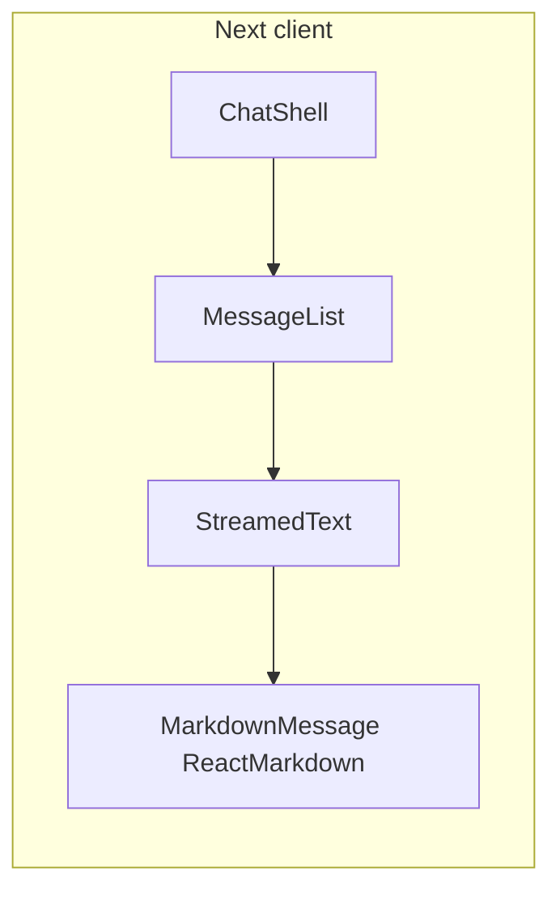

# Chat UI: Markdown + word-by-word reveal

## Context and constraints

- The prompt references **Tailwind CSS v4** and `**useChat`** from the AI SDK; this repo uses **[Tailwind v3.4.1](frontend/package.json)** (`@tailwind` directives in [globals.css](frontend/app/globals.css)) and **custom state** in [ChatShell.tsx](frontend/components/chat/ChatShell.tsx) / [sendMessage.ts](frontend/lib/chat/sendMessage.ts) (full JSON reply, no SSE). The plan **keeps the current architecture** and implements the **StreamedText + timer** approach from the prompt; adopting `useChat` or true token streaming would require new backend/SSE work and is out of scope unless you add it later.
- **Master Mixologist / CocktailDB** behavior stays server-side ([agentSession](mixologist-cli/src/agentSession.ts)); this change is **presentation only**.

## 1. Dependencies and Tailwind Typography

- In [frontend/package.json](frontend/package.json): add `**react-markdown`**, `**remark-gfm`** (runtime), and `**@tailwindcss/typography**` (devDependency).
- In [frontend/tailwind.config.ts](frontend/tailwind.config.ts): register the `**typography` plugin** (`import typography from "@tailwindcss/typography"` / `plugins: [typography]`).

## 2. Markdown rendering component

- Add a small client component, e.g. [frontend/components/chat/MarkdownMessage.tsx](frontend/components/chat/MarkdownMessage.tsx):
  - Wrap content with `**<ReactMarkdown remarkPlugins={[remarkGfm]}>`**.
  - Apply `**prose`** variants for chat bubbles: e.g. `prose prose-sm max-w-none dark:prose-invert` plus zinc-tuned `**prose-headings`**, `**prose-p`**, `**prose-ul**`, `**prose-ol**`, `**prose-code**`, `**prose-pre**` overrides via `className` so lists/code fit inside the rounded bubble (narrow max width already on parent).
  - Keep **user** messages as **plain text** (existing `<p>`) unless you want parity; the prompt emphasizes **agent** formatting.

## 3. `StreamedText` (word-by-word reveal)

- Add [frontend/components/chat/StreamedText.tsx](frontend/components/chat/StreamedText.tsx) with typed props, e.g. `{ fullText: string; play: boolean; onComplete?: () => void }`.
  - **Tokenization**: split into words by whitespace while **preserving** spaces/newlines (regex split on `(\s+)` and interleave), or a simple **word + delimiter** accumulator so the visible string grows naturally.
  - **Animation**: `useEffect` + `setInterval` or `requestAnimationFrame` with a stable interval (e.g. 25–40ms per word, capped so huge answers do not take minutes—optional **max duration** or **burst** after N words).
  - **When `play` is false** (e.g. historical messages): show **full text immediately** (no animation).
  - **Markdown + partial syntax**: render the **current visible prefix** through the same `MarkdownMessage` (or inline `ReactMarkdown`). Add a tiny **string sanitizer** for the streaming prefix only—e.g. strip a **trailing** unclosed

```, or **odd** count of `*` at the end—to reduce broken emphasis while the suffix is still hidden. Document that edge cases (half-open fenced code blocks) may still show as literal text until the stream catches up; acceptable tradeoff without a full incremental parser.

## 4. Integrate in `MessageList`

- Update [frontend/components/chat/MessageList.tsx](frontend/components/chat/MessageList.tsx):
  - For **assistant** `Message`s: replace the raw `<p>{m.content}</p>` with `**StreamedText`** + markdown path.
  - **Play animation only for the latest assistant message** after it appears (derive `lastAssistantMessage` from `messages`; set `play={m.id === lastAssistant.id}` or use a ref/callback from parent when a new reply lands so older bubbles stay static).
  - Add `**scroll-smooth`** on the scroll container (`className` includes `scroll-smooth`) alongside existing `scrollIntoView({ behavior: "smooth" })` so both CSS and JS reinforce smooth scrolling as words append.

## 5. Optional `ChatShell` tweak

- If the scroll anchor should fire **per tick** during word reveal, pass `**onStreamTick`** from `StreamedText` (`onComplete` + optional per-step callback) and have `MessageList` scroll when the visible text grows—otherwise rely on `useEffect` deps including a **stream generation counter** lifted from `StreamedText` or parent. Minimal approach: `**useEffect` in `StreamedText` that calls `onProgress`** each visible update; `MessageList` passes a stable callback that scrolls `endRef` into view.

## 6. Verification

- `npm run build -w frontend` (and lint).
- Manual: assistant reply with `**bold`**, list, and `inline` / fenced code; confirm typewriter then stable markdown; dark mode readability.




