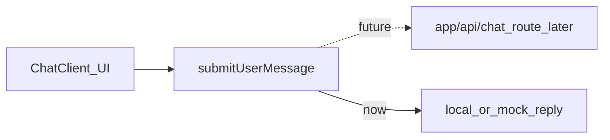

# Dockerized Next.js chat shell for Bartender

## Context from [bartender_technical_plan.md](bartender_technical_plan.md)

The spec already calls for **Next.js (App Router)**, **TypeScript**, and **Tailwind CSS**. This initial slice delivers only the **UI shell** and **Docker** setup; MCP, LangChain, and CocktailDB integration stay out of scope until you add them.

## 1. Scaffold the Next.js app

From the repo root `[/home/reidenw/projects/bartender](bartender_technical_plan.md)`:

- Run `create-next-app@latest` with: **App Router**, **TypeScript**, **Tailwind**, **ESLint**, no `src/` directory (keeps paths shallow; optional `src/` if you prefer—pick one and stay consistent).
- Remove default marketing boilerplate from `app/page.tsx` in favor of a single chat home route.

No extra UI library is required; Tailwind matches the technical plan.

## 2. Chat layout (ChatGPT-like, no backend)

Implement a **three-region layout** similar to common AI chat UIs:

| Region         | Role                                                                                                  |
| -------------- | ----------------------------------------------------------------------------------------------------- |
| Narrow sidebar | Bold wordmark **"Bartender"** (text-only logo), optional placeholder nav for future (e.g. "New chat") |
| Main column    | Scrollable message list (empty state + user/assistant bubbles)                                        |
| Bottom         | Fixed composer: textarea + send button (Enter to send, Shift+Enter for newline)                       |

**Visual/UX details:** subtle border between sidebar and main, full viewport height (`min-h-screen`, `flex`), message area `flex-1 overflow-y-auto`, composer pinned with a light top border or shadow so it stays usable on mobile (mobile-first per spec).

**State (client-only for now):** a `Message` type (`id`, `role: 'user' | 'assistant'`, `content`, optional `createdAt`) and React state in a **client** chat container component. Sending appends a user message; for now you can either show no assistant reply or a single static placeholder line—your call at implementation time, but the structure should assume **assistant messages will eventually come from the server**.

## 3. Future backend hook (no server logic yet)

Keep the UI dumb and swap-friendly:

- `**lib/chat/types.ts`** — shared `Message` (and later, request/response types).
- `**lib/chat/actions.ts` or `lib/chat/sendMessage.ts`** — single async function, e.g. `submitUserMessage(messages, text)`, that **today** returns a mocked assistant message or empty; **later** becomes `fetch('/api/chat', …)` or a Server Action calling LangChain. The chat UI only calls this function.
- `**app/api/`** — add nothing functional yet, or a minimal `app/api/health/route.ts` returning `{ ok: true }` so Docker healthchecks and future routes have a clear home.

This matches the eventual **Next.js API / Route Handlers** + **LangChain** direction without implementing agents now.

## 4. Docker

- `**next.config.ts**`: set `output: 'standalone'` for a smaller, self-contained Node output (official Next Docker pattern).
- `**Dockerfile**`: multi-stage — deps install, `next build`, then runtime stage copying `.next/standalone`, `.next/static`, and `public`; run as non-root; `EXPOSE 3000`; `CMD` runs the standalone server.
- `**.dockerignore**`: `node_modules`, `.git`, `.next`, `README`, etc., to keep builds fast.
- `**docker-compose.yml**`: build the image, map `3000:3000`, optional env file placeholder for future API keys.

Optional (document in comments or a short note in compose): a **dev** override using `npm run dev` + bind mounts for hot reload is possible but slower on WSL2; the primary deliverable is a **reproducible production-style** container.

## 5. Files to add or touch (summary)

| Path                                                | Purpose                                                                   |
| --------------------------------------------------- | ------------------------------------------------------------------------- |
| `app/layout.tsx`                                    | Root layout, font/metadata                                                |
| `app/page.tsx`                                      | Compose sidebar + chat                                                    |
| `components/chat/`*                                 | `ChatShell`, `MessageList`, `Composer` (split keeps future changes small) |
| `lib/chat/types.ts`, `lib/chat/sendMessage.ts`      | Types + single integration point for backend                              |
| `Dockerfile`, `.dockerignore`, `docker-compose.yml` | Container workflow                                                        |
| `next.config.ts`                                    | `standalone` output                                                       |

## 6. Verification (after plan approval)

- `docker compose build && docker compose up` → app on `http://localhost:3000`
- Local: `npm run build` succeeds
- UI: type messages, see them in the thread, layout resembles a basic chat product with **Bartender** wordmark

