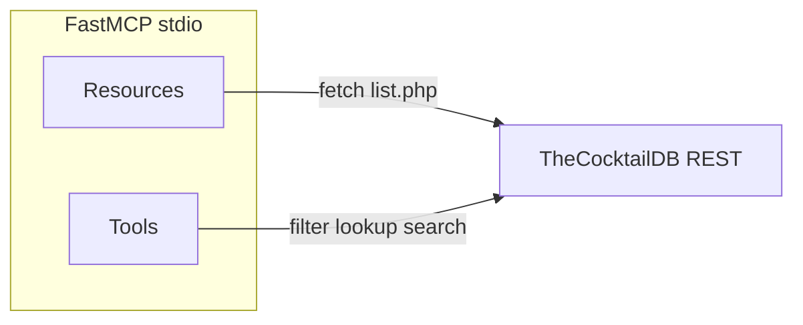

# FastMCP server for TheCocktailDB

## Context

- [MCP_Server/src/index.ts](MCP_Server/src/index.ts) is a placeholder; [MCP_Server/package.json](MCP_Server/package.json) has TypeScript + `tsx` but no MCP stack yet.
- Base URL (key `1` already in path): `https://www.thecocktaildb.com/api/json/v1/1/`.
- [bartender_technical_plan.md](bartender_technical_plan.md) matches [plan.md](plan.md) on endpoints; use **resource URIs from plan.md** (`cocktaildb://list/...`) so they match what you documented (the technical plan’s `resource://` prefix is alternate naming only).

## Architecture

- **Shared helper** (either a small `src/cocktailDb.ts` or private functions in `index.ts`): `fetchJson<T>(path: string): Promise<T>` using native `fetch`, `encodeURIComponent` for dynamic query values, and a single `BASE` constant. No extra HTTP library required.
- **Response normalization**: The API often returns `{ drinks: null }` when empty. Normalize to **always** return JSON-friendly shapes for tools, e.g. `{ drinks: [] }` for list-style endpoints and `{ drink: null }` or `{ drinks: [] }` for details/search—pick one consistent convention and document it in tool descriptions (e.g. “`drinks` is always an array; empty means no match”).
- **Resources**: `server.addResource` per FastMCP (`[addResource` pattern]([https://unpkg.com/fastmcp@3.34.0/README.md](https://unpkg.com/fastmcp@3.34.0/README.md))): fixed URIs, `mimeType: "application/json"`, `load()` returns `{ text: JSON.stringify(...) }` after parsing and optionally trimming to the useful array (`drinks` / list payload) so the agent gets compact JSON.
  - `cocktaildb://list/ingredients` → `list.php?i=list`
  - `cocktaildb://list/categories` → `list.php?c=list`
  - `cocktaildb://list/glassware` → `list.php?g=list`
- **Tools**: `server.addTool` with **Zod** `parameters` (FastMCP expects [Standard Schema](https://standardschema.dev/); Zod is the documented default). Return **stringified JSON** from `execute` (FastMCP’s quick-start pattern) so LangChain/agents get parseable structured output.
  - `get_cocktails_by_ingredient` → `filter.php?i={ingredient}`. Description: use for inventory-driven discovery (“which drinks use this ingredient?”); mention matching CocktailDB ingredient strings from the ingredients resource.
  - `get_cocktail_details` → `lookup.php?i={id}` (drink `idDrink` from list/search results). Description: full recipe for **subset analysis**—compare `strIngredient1…15` / measures against bar stock.
  - `search_cocktail_by_name` → `search.php?s={name}`. Description: resolve names to IDs before calling details.
- **Hints**: Set `readOnlyHint: true` on all three tools (read-only data access).
- **Runtime**: `new FastMCP({ name, version })`, then `server.start({ transportType: "stdio" })` so Cursor/other clients can spawn `node dist/index.js` or `tsx src/index.ts`.

## Dependencies

Add to [MCP_Server/package.json](MCP_Server/package.json): `fastmcp` and `zod` (runtime dependencies). Keep existing `devDependencies` as-is.

## Verification (after implementation)

- `npm run build -w mcp-server` from repo root (workspace name is the package `"name": "mcp-server"`).
- Optional: `npx fastmcp inspect MCP_Server/src/index.ts` if you install/use the FastMCP CLI locally.
- Smoke-test one list URL and one tool path with `curl` to confirm shapes.

## Cursor / client config (manual)

Point the MCP config at the built entry (`node .../MCP_Server/dist/index.js`) or `npx tsx .../MCP_Server/src/index.ts` for dev—no repo change required unless you want a documented snippet elsewhere.

## Note on root `build:all`

[package.json](package.json) already uses `-w mcp-server`, which matches the workspace package name; no change needed unless builds fail (then verify workspace resolution).