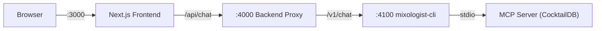

# Hospitality Consultant Pivot

## Current Architecture




The agent is defined in [mixologist-cli/src/agentSession.ts](mixologist-cli/src/agentSession.ts), with the system prompt in `buildSystemPrompt()`. Tools are MCP-based CocktailDB lookups. The frontend in [frontend/components/chat/ChatShell.tsx](frontend/components/chat/ChatShell.tsx) is a single-panel chat UI.

---

## 1. Agent Persona and System Prompt

**File:** [mixologist-cli/src/agentSession.ts](mixologist-cli/src/agentSession.ts)

Rewrite `buildSystemPrompt()` to:

- Set role to **Expert Hospitality Consultant** helping bar owners design seasonal menus
- Define a **Discovery Phase** workflow: the agent must first ask about bar theme, target demographics, price points, and inventory constraints before suggesting drinks
- Set tone to **professional, analytical, and efficiency-oriented**
- Instruct the agent to use `validate_theme` before finalizing drink selections
- Instruct the agent to call `submit_menu` with structured JSON when presenting a final menu

Update internal references:

- `TOOL_NAMES` set to include new tools
- Keep "mixologist" branding in `runName` tags and all user-facing strings

---

## 2. New Tool: `validateTheme`

**New file:** `mixologist-cli/src/tools/validateTheme.ts`

A LangChain `DynamicStructuredTool` (not MCP) that checks whether a drink fits a bar's declared theme. Implementation:

- Accepts `{ drinkName: string, theme: string, drinkStyle: string }` via Zod schema
- Uses a rule-based mapping of theme keywords to disallowed drink characteristics (e.g., "speakeasy" / "1920s" disallows tropical/tiki drinks; "tiki" disallows stirred spirit-forward classics)
- Returns `{ valid: boolean, reason: string }`

This is a local tool added directly to the LangChain agent's tool array (alongside the MCP tools) since it requires no external API.

---

## 3. Structured Output: MenuSchema

**New file:** `mixologist-cli/src/tools/menuSchema.ts`

Define the Zod schema from the prompt:

```typescript
const MenuItemSchema = z.object({
  name: z.string(),
  ingredients: z.array(z.string()),
  margin: z.number(),
  description: z.string(),
});

const MenuSchema = z.object({
  menuName: z.string(),
  concept: z.string(),
  items: z.array(MenuItemSchema),
});
```

**New file:** `mixologist-cli/src/tools/submitMenu.ts`

A `DynamicStructuredTool` named `submit_menu` that:

- Accepts the full `MenuSchema` as its input
- Validates it with Zod `.parse()`
- Returns the validated JSON stringified, prefixed with a sentinel marker (e.g., `<!--MENU_JSON-->{ ... }<!--/MENU_JSON-->`) so the downstream layers can extract it

The agent's system prompt will instruct it to call this tool when presenting a finalized menu.

---

## 4. Agent Session Wiring

**File:** [mixologist-cli/src/agentSession.ts](mixologist-cli/src/agentSession.ts)

- Import `validateThemeTool` and `submitMenuTool`
- Append them to the `tools` array alongside the MCP tools
- Update `TOOL_NAMES` to include the new tool names for validation
- No changes needed to model config (`ChatAnthropic` stays the same)

---

## 5. API Response: Extract Menu Data

**File:** [mixologist-cli/src/server.ts](mixologist-cli/src/server.ts)

Update the `/v1/chat` handler:

- After extracting `reply` text, scan for the `<!--MENU_JSON-->...<!--/MENU_JSON-->` sentinel
- If found, parse the JSON and include it as a `menu` field in the response: `{ reply, menu }`
- Strip the sentinel from the `reply` text so the chat message reads cleanly

**File:** [backend/src/index.ts](backend/src/index.ts) -- no changes needed (transparent proxy).

**File:** [frontend/app/api/chat/route.ts](frontend/app/api/chat/route.ts) -- no changes needed (transparent proxy).

---

## 6. Frontend: Split Layout

**File:** [frontend/lib/chat/types.ts](frontend/lib/chat/types.ts)

Add a `Menu` type matching the Zod schema, and update `Message` to optionally carry `menu?: Menu`.

**File:** [frontend/lib/chat/sendMessage.ts](frontend/lib/chat/sendMessage.ts)

Update `submitUserMessage` to parse the `menu` field from the API response and attach it to the returned `Message`.

---

## 7. Frontend: Two-Panel UI

**File:** [frontend/components/chat/ChatShell.tsx](frontend/components/chat/ChatShell.tsx)

Refactor the layout from single-panel to a two-column split:

- **Left panel (~50-60%):** "Consultant Chat" -- existing chat components (MessageList + Composer)
- **Right panel (~40-50%):** "Live Menu Canvas" -- renders the latest `menu` from messages
- On mobile, the canvas collapses below the chat or into a toggleable drawer
- Keep "Mixologist" branding in the sidebar

**New file:** `frontend/components/menu/MenuCanvas.tsx`

A component that:

- Accepts the current `Menu | null` as a prop
- Renders the menu name, concept, and a styled card grid of menu items
- Each item card shows: name, description, ingredient list, margin percentage
- Shows a placeholder/empty state when no menu has been generated yet

**File:** [frontend/components/chat/MessageList.tsx](frontend/components/chat/MessageList.tsx)

- Update empty-state text to be consultant-focused (e.g., "Describe your bar concept to get started") while keeping "Mixologist" name
- Keep "Mixologist is thinking..." text

**File:** [frontend/app/layout.tsx](frontend/app/layout.tsx)

- Update metadata description to mention menu consulting (keep "Mixologist" as the title)

---

## 8. Dependencies

- `zod` is already in `mixologist-cli/package.json`
- `langchain` already installed -- `DynamicStructuredTool` is available from it
- No new frontend dependencies needed

