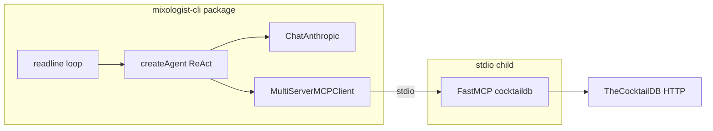

# LangChain Master Mixologist CLI

## Context

- Your CocktailDB server already runs **stdio** transport and registers the three tools named in the prompt plus resources including `[cocktaildb://list/ingredients](MCP_Server/src/index.ts)` (`[get_cocktails_by_ingredient](MCP_Server/src/index.ts)`, `[get_cocktail_details](MCP_Server/src/index.ts)`, `[search_cocktail_by_name](MCP_Server/src/index.ts)`).
- `[.gitignore](.gitignore)` already ignores `.env`*, `node_modules/`, and `MCP_Server/dist/`; no change required unless you want an explicit `.env` line (redundant with `.env`*).
- The repo is an npm workspace (`[package.json](package.json)`: `frontend`, `backend`, `MCP_Server`).

## Architecture

## 1. New workspace package

- Add a package (e.g. `mixologist-cli/` or `langchain-mixologist/`) with `"type": "module"`, **strict** `[tsconfig.json](MCP_Server/tsconfig.json)` aligned to **NodeNext** (same as MCP server), `src/main.ts` entry, and scripts: `build` (`tsc`), `start` (`node dist/main.js`), optional `dev` (`tsx`).
- Register the folder in root `[package.json](package.json)` `workspaces`.
- **Dependencies** (per prompt + LangChain docs): `langchain`, `@langchain/anthropic`, `@langchain/mcp-adapters`, `@modelcontextprotocol/sdk`, `dotenv`, `zod`. Add `tsx` as devDependency if you use `dev`.

## 2. Environment and secrets

- Create `**.env`** in the new package (or repo root—pick one and document in README only if you add run instructions elsewhere; the prompt asks for the file, not docs): `ANTHROPIC_API_KEY=...`.
- Add `**.env.example`** in the same place with placeholder `ANTHROPIC_API_KEY=` (safe to commit; root ignore already allows `!.env.example`).

## 3. MCP client (stdio)

- Configure `[MultiServerMCPClient](https://docs.langchain.com/oss/javascript/langchain/mcp)` with one server key (e.g. `cocktaildb`):
  - `transport: "stdio"`
  - `command: "node"`
  - `args: [absolutePathToBuiltServer]` where the built artifact is `[MCP_Server/dist/index.js](MCP_Server/src/index.ts)` (resolve with `import.meta.url` / `fileURLToPath` so it works from the CLI package).
- **Prerequisite**: document that `npm run build -w mcp-server` must succeed before running the CLI (or optionally support `tsx` + `MCP_Server/src/index.ts` behind an env flag for local dev).
- Use `**await client.getTools()`** from `@langchain/mcp-adapters` (equivalent to the prompt’s `loadMcpTools` example: same package, supported high-level API). Optionally **filter** the returned tools by the three names so future server tools do not change agent behavior unexpectedly.

## 4. Ingredient resource → system context

- MCP resources are **not** automatically injected into the model. Use `**client.readResource()`** (JS client exposes this—see [reference](https://reference.langchain.com/javascript/langchain-mcp-adapters/MultiServerMCPClient)) once at startup for `cocktaildb://list/ingredients`, then embed the returned text (JSON) into the **system** instructions so the model can match CocktailDB spelling before calling `get_cocktails_by_ingredient`.
- If the payload is very large for context limits, a follow-up optimization would be a small wrapper tool that reads the resource on demand; **initial plan**: full list in system prompt unless you hit token issues in practice.

## 5. Model and agent

- Instantiate `**ChatAnthropic`** with `model: "claude-sonnet-4-6"` (or the exact API id LangChain maps for that alias—verify at install time).
- Enable **extended thinking** via the constructor options supported by `@langchain/anthropic` for JS (e.g. `thinking: { type: "enabled", budget_tokens: ... }` and ensure `maxTokens` exceeds the budget per Anthropic rules). If Sonnet 4.6 prefers **adaptive** thinking in the SDK, use that mode instead after checking the installed package types.
- Build the agent with `**createAgent`** from `langchain` (current ReAct-style API; satisfies “`create_react_agent` or similar” from the prompt). Pass:
  - the configured `ChatAnthropic` instance as `model` / `llm` per the version’s `CreateAgentParams`
  - MCP tools from step 3
  - **System prompt**: Master Mixologist persona; require consulting the embedded canonical ingredient list before ingredient-based tool calls; describe tool usage patterns (recommendations → `get_cocktails_by_ingredient` + optional `get_cocktail_details`; name/ingredient questions → `search_cocktail_by_name` then `get_cocktail_details`).

## 6. CLI loop and errors

- Use Node `**readline`** (or `readline/promises`): prompt, read lines, `**await agent.invoke({ messages })`** with accumulated conversation state (append user and assistant messages each turn).
- **Error handling**: wrap `invoke` and MCP setup in try/catch; on failure log a clear message (API key missing, subprocess spawn failure, tool timeout). Optionally set model `maxRetries` / timeouts if exposed by `ChatAnthropic`.
- On shutdown, call `**client.close()`** if the API provides it, and exit readline cleanly.

## 7. Optional repo polish

- Extend root `**build:all`** to build the new package if you add a `build` script there.

## 8. Backend Dockerization

**Constraint today:** `[backend/src/index.ts](backend/src/index.ts)` only logs and exits, so a container would stop immediately. As part of dockerization, give the backend a **minimal long-lived process**: e.g. `http.createServer` listening on `process.env.PORT ?? 4000`, responding `200` on `GET /health` (JSON or plain text), and `404` elsewhere. This matches the pattern used by the frontend image (`[frontend/Dockerfile](frontend/Dockerfile)` healthcheck against `/api/health`) and gives Compose a meaningful health probe.

`**backend/Dockerfile`** (multi-stage, workspace-aware—mirror the monorepo copy strategy from `[frontend/Dockerfile](frontend/Dockerfile)`):

- **base**: `node:20-alpine`, `WORKDIR /app`, optional `libc6-compat` like the frontend.
- **deps**: copy root `package.json` + `package-lock.json`, copy `backend/package.json` (and any other workspace `package.json` files required so `npm ci` can resolve the lockfile—same idea as frontend which copies frontend/backend/MCP_Server manifests). Run `npm ci -w backend` (or `npm ci` with workspace filter) to install only what the backend needs for production.
- **builder**: copy `backend` sources, run `npm run build -w backend` (`tsc` → `dist/`).
- **runner**: production `NODE_ENV`, non-root user (optional but consistent with `web`), copy only `backend/package.json` + `backend/dist` + production `node_modules` from deps/builder as appropriate. Prefer **omit devDependencies** in the final stage (either `npm ci -w backend --omit=dev` in deps stage used for runner, or a dedicated `prod-deps` stage).
- **EXPOSE** the backend port (e.g. `4000`).
- **HEALTHCHECK**: `wget`/`curl` against `http://127.0.0.1:$PORT/health` or a small `node -e` HTTP GET (Alpine may need `wget` installed, or use Node one-liner like the frontend image).
- **CMD**: `node backend/dist/index.js` (adjust path to match `WORKDIR` layout).

`**[docker-compose.yml](docker-compose.yml)`**:

- Add a `**backend`** service: `build.context: .`, `dockerfile: backend/Dockerfile`.
- Map a host port (e.g. `4000:4000`) and set `environment` / optional `env_file` for future API keys.
- Uncomment or replace the existing “Future services” comment for `backend` so `docker compose up` can run **web** and **backend** together when desired.
- If the frontend must call the backend from the browser, document `NEXT_PUBLIC`_* or server-side API URL for cross-container hostname (`http://backend:4000` on the Compose network vs `localhost` from the host).

`**.dockerignore`** (repo root): if missing or incomplete, add one to shrink build context—at minimum `node_modules`, `**/dist`, `.git`, `frontend/.next`, and env files—so backend and frontend builds stay fast and deterministic.

## Files to add (expected)

| Path                           | Role                                                    |
| ------------------------------ | ------------------------------------------------------- |
| `mixologist-cli/package.json`  | deps, `start` script                                    |
| `mixologist-cli/tsconfig.json` | strict, NodeNext                                        |
| `mixologist-cli/src/main.ts`   | dotenv, MCP client, readResource, createAgent, readline |
| `mixologist-cli/.env`          | local only (gitignored)                                 |
| `mixologist-cli/.env.example`  | committed template                                      |
| `backend/Dockerfile`           | multi-stage image for backend workspace                 |
| `.dockerignore` (root)         | optional new or extend; smaller context for all images  |

## Risk notes

- **LangChain package versions**: `createAgent` + `MultiServerMCPClient` APIs should be pinned to mutually compatible releases; resolve any param naming (`model` vs `llm`) from the installed `langchain` types.
- **MCP session model**: LangChain docs note stateless tool sessions by default; if you see flaky behavior or slow cold starts, consider their “stateful sessions” pattern later—not required for the first vertical slice.
- **Backend Docker**: npm workspaces require copying enough of the repo for `package-lock.json` to install the `backend` workspace correctly; validate `docker compose build backend` after changes to root or backend `package.json`.

