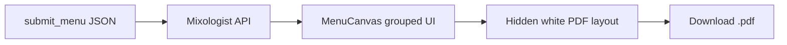

# Menu PDF export (white background, by category)

## Current state

- `[mixologist-cli/src/tools/menuSchema.ts](mixologist-cli/src/tools/menuSchema.ts)` defines `MenuItem` as `name`, `ingredients`, `margin`, `description` — **no category**.
- `[frontend/components/menu/MenuCanvas.tsx](frontend/components/menu/MenuCanvas.tsx)` renders a **flat grid** of cards.
- `[frontend/package.json](frontend/package.json)` has no PDF dependencies yet.

Categories must come from structured data (the model cannot reliably infer them after the fact). Extending the schema is therefore required for correct PDF sections.

## 1. Extend the menu schema and agent contract

**Files:** `[mixologist-cli/src/tools/menuSchema.ts](mixologist-cli/src/tools/menuSchema.ts)`, `[mixologist-cli/src/tools/submitMenu.ts](mixologist-cli/src/tools/submitMenu.ts)`, `[mixologist-cli/src/agentSession.ts](mixologist-cli/src/agentSession.ts)`

- Add `**category: z.string()`** (non-empty) to `MenuItemSchema`.
- Update the `submit_menu` tool description so the model must supply a human-readable section label per drink (e.g. *Signature*, *Classics*, *Low-ABV*, *Zero-proof*), aligned with how the menu is presented to the guest.
- In `buildSystemPrompt`, add a short bullet under the menu-design phase: each item in `submit_menu` must include `**category`**, and drinks should be grouped logically into a small set of consistent category names.

**Frontend types:** `[frontend/lib/chat/types.ts](frontend/lib/chat/types.ts)` — add `category: string` to `MenuItem`.

**Validation:** `[mixologist-cli/src/server.ts](mixologist-cli/src/server.ts)` already uses `MenuSchema.safeParse` on extracted menu JSON; it will automatically enforce the new field once the schema is updated.

**Note:** Any in-flight or cached responses without `category` will fail validation and omit `menu` in the API response. If you need backward compatibility for old transcripts, we can add `category: z.string().optional().default("Uncategorized")` instead of a required string — say so before implementation.

## 2. Group the live canvas by category

**File:** `[frontend/components/menu/MenuCanvas.tsx](frontend/components/menu/MenuCanvas.tsx)`

- Derive **ordered sections**: iterate `menu.items` and build a list of unique category names in **first-seen order** (stable, predictable).
- For each section, render a **category heading** then the same card layout as today for items in that section.
- Keep existing dark/light styling for the in-app panel; this is independent of the PDF (below).

Optional small helper in the same file or `frontend/lib/menu/groupByCategory.ts`: `groupMenuItemsByCategory(items)`.

## 3. PDF export (white background, sectioned cards)

**Approach:** Client-only export from the Next.js app (no new backend route). Use a library that turns **HTML → PDF** with automatic pagination:

- Add `**html2pdf.js`** (bundles `jspdf` + `html2canvas`) to `[frontend/package.json](frontend/package.json)`, or add `jspdf` + `html2canvas` explicitly if you prefer finer control.

**Implementation sketch:**

1. Add a `**MenuPdfDocument`** (or similar) presentational component that:
  - Uses `**backgroundColor: '#ffffff'`** on the root and **dark text** (`zinc-900` / `zinc-600`) so the PDF is always readable on white regardless of app theme.
  - Renders **menu title + concept**, then **for each category** (same grouping as the canvas): an `h2`-level heading and card blocks (name, margin %, description, ingredients) with simple borders/spacing — no reliance on Tailwind dark mode.
2. Render this for export in one of:
  - A **hidden off-screen** container (`position: fixed; left: -10000px; width: ~794px` for A4-ish width at 96dpi), or
  - A **portal** with `aria-hidden` so it is not visible but still in the layout tree for `html2canvas`.
3. `**Export PDF` button** in the menu panel header (next to the title area in `MenuCanvas`, or passed as a slot) that:
  - `dynamic import('html2pdf.js')` (or the chosen API) so it does not break SSR.
  - Calls the library with options: **white page background**, margins, **filename** derived from `menu.menuName` (sanitized).
4. **Loading/disabled state** on the button while generating to avoid double-clicks.

**Edge cases:** Very long menus may produce tall canvases; `html2pdf.js` generally handles multi-page splits — verify with a long fixture after wiring. If quality is poor, fallback is `@react-pdf/renderer` with explicit `Page` breaks (more layout duplication).

## 4. What we will not change (unless you ask)

- No new Docker services or server-side PDF generation.
- No edits to unrelated markdown/docs.

## 5. Manual verification

- Run a consultation that ends with `submit_menu` and confirm each item includes `**category**`.
- Open the menu panel, confirm **section headings** match categories.
- Click **Export PDF**, open the file: **white background**, **sections with headings**, cards under each section.

