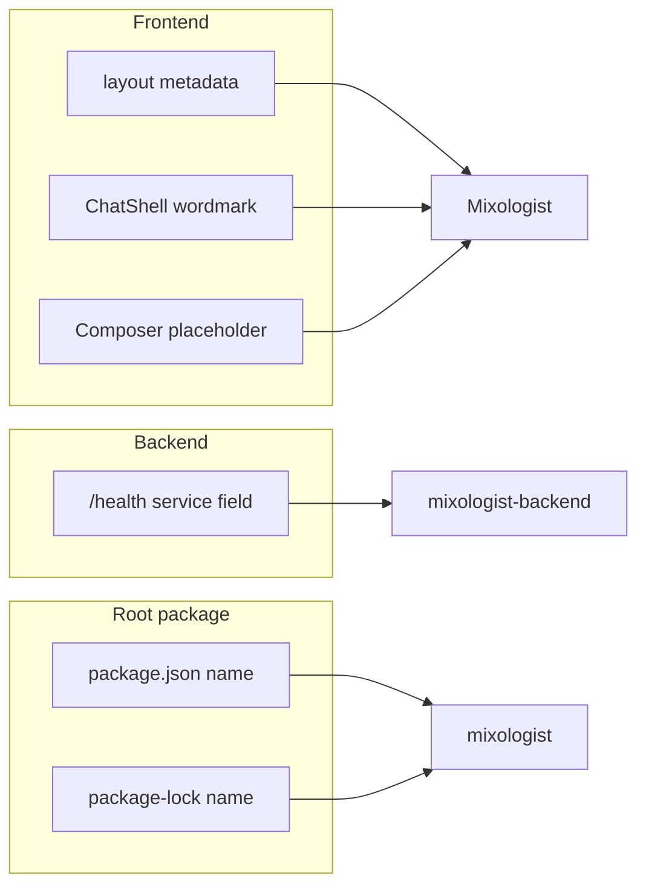

# Rebrand Bartender → Mixologist

## What we found

| Area              | Files                                                                            | Change                                                                                                                                                                      |
| ----------------- | -------------------------------------------------------------------------------- | --------------------------------------------------------------------------------------------------------------------------------------------------------------------------- |
| **UI / metadata** | [frontend/app/layout.tsx](frontend/app/layout.tsx)                               | `metadata.title`: `"Bartender"` → `"Mixologist"`                                                                                                                            |
|                   | [frontend/components/chat/ChatShell.tsx](frontend/components/chat/ChatShell.tsx) | Two wordmark strings (lines ~60, ~78)                                                                                                                                       |
|                   | [frontend/components/chat/Composer.tsx](frontend/components/chat/Composer.tsx)   | Placeholder: `Message Bartender…` → `Message Mixologist…`                                                                                                                   |
| **API**           | [backend/src/index.ts](backend/src/index.ts)                                     | Health JSON `service: "bartender-backend"` → `"mixologist-backend"` (only occurrence in backend)                                                                            |
| **npm workspace** | [package.json](package.json)                                                     | `"name": "bartender"` → `"mixologist"` (npm packages use lowercase)                                                                                                         |
|                   | [package-lock.json](package-lock.json)                                           | Root `"name"` appears twice (lines 2 and 7); set both to `"mixologist"` **or** run `npm install` at repo root after editing `package.json` so the lockfile stays consistent |

**Already aligned:** [docker-compose.yml](docker-compose.yml) uses a `mixologist` service and `MIXOLOGIST_`* env vars; [frontend/package.json](frontend/package.json) is named `frontend` (no bartender string). [backend/dist/](backend/dist/) is gitignored—rebuild after the TS change if you run from `dist`.

**No matches** in `mixologist-cli/`, `MCP_Server/`, or `.prompts/bartender_technical_plan.md` body text (only the **filename** contains `bartender`).

## Explicitly out of scope

- **Do not** rename, move, or edit any files under `[.cursor/plans/](.cursor/plans/)` or `[.prompts/](.prompts/)` (including keeping `bartender_technical_plan.md` as-is). Those paths may still contain “Bartender” after the rebrand.
- The **directory** `/home/reidenw/projects/bartender` is your local clone path; renaming the folder remains a manual/git-remote step, not part of this change set.

## Verification

After edits: `rg -i bartender` should show no matches in `frontend/`, `backend/src/`, root `package.json`, and root `package-lock.json` (you may still see hits under `.cursor/plans`, `.prompts`, and the `.prompts` filename). Run `npm run build -w backend` if you execute the compiled server from `dist`.

