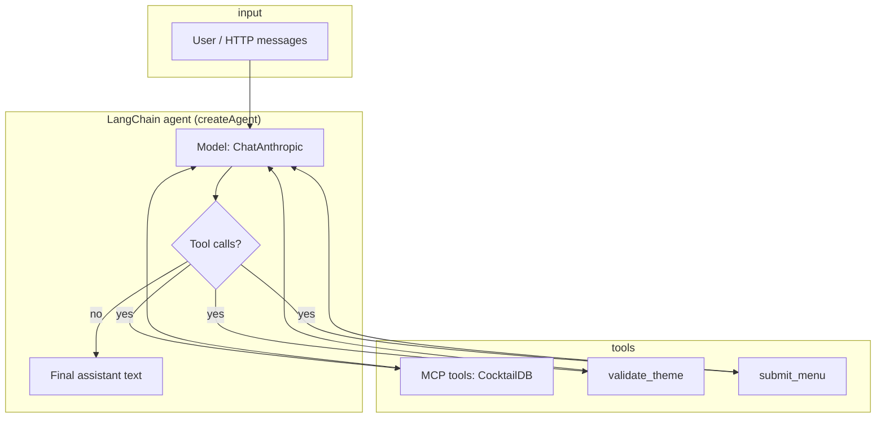

# Architecture

This document describes how requests move through the bartender monorepo and how the Mixologist agent runs with tools and streaming.

## High-level components

```text
┌─────────────┐     ┌──────────────────┐     ┌─────────────────┐     ┌────────────────────┐
│   Browser   │────▶│  Next.js (3000)  │────▶│  backend (4000) │────▶│ mixologist-cli (4100)│
│             │     │  POST /api/chat  │     │ POST /api/chat   │     │ POST /v1/chat        │
└─────────────┘     └──────────────────┘     └─────────────────┘     └──────────┬───────────┘
                                                                                 │
                    Anthropic API ◀──────────────────────────────────────── model │
                                                                                 │
                    ┌────────────────────┐     ┌───────────────────────────────┘
                    │ MCP_Server (stdio)  │◀────┤ MultiServerMCPClient
                    │  node dist/index.js │     │  (child process)
                    └──────────┬──────────┘
                               │
                               ▼
                    ┌──────────────────────┐
                    │  TheCocktailDB HTTPS │
                    └──────────────────────┘
```

- **Web path**: User → Next.js [`frontend/app/api/chat/route.ts`](../frontend/app/api/chat/route.ts) (proxies using `BACKEND_URL`) → [`backend/src/index.ts`](../backend/src/index.ts) `POST /api/chat` → mixologist `POST /v1/chat` with `MIXOLOGIST_URL`. The backend forwards the response body and `Content-Type` (including `application/x-ndjson` when mixologist streams).
- **CLI path**: [`mixologist-cli/src/main.ts`](../mixologist-cli/src/main.ts) loads [`createMixologistSession()`](../mixologist-cli/src/agentSession.ts) and calls `agent.invoke` with in-memory `history`. No HTTP backend or frontend is involved.
- **MCP**: Mixologist spawns the MCP server as a **stdio** child (`node` + path from `MCP_SERVER_PATH` or default `MCP_Server/dist/index.js`). The same process handles LangChain tool calls over MCP.
- **CocktailDB**: Only the MCP server calls `https://www.thecocktaildb.com/...` (see [`MCP_Server/src/cocktailDb.ts`](../MCP_Server/src/cocktailDb.ts)).

## Agent reasoning loop (LangChain `createAgent`)

The agent is a ReAct-style loop: the model alternates between assistant messages (possibly with tool calls) and tool results until it produces a final assistant reply.



Grounding rules and phase ordering are enforced in the **system prompt** built in [`mixologist-cli/src/agentSession.ts`](../mixologist-cli/src/agentSession.ts) (discovery before menu design, tool use for recommendations).

## HTTP streaming: NDJSON and progress lines

For `POST /v1/chat`, [`mixologist-cli/src/server.ts`](../mixologist-cli/src/server.ts) streams the agent with `streamMode: ["updates", "values"]`.

- **`updates` chunks**: Passed to [`statusMessagesFromUpdatesChunk`](../mixologist-cli/src/progressLabels.ts), which emits short human-readable lines (e.g. “Looking up drinks by ingredient…”, “Drafting a reply…”). Each line is written as one NDJSON object: `{ "type": "status", "message": "..." }`.
- **`values` chunks**: Used to keep the latest full `messages` array (transcript) for post-processing.
- **End of stream**: A single `{ "type": "result", "reply": "...", "menu": { ... } }` line when a validated menu was extracted; otherwise `reply` only. On failure after headers are sent: `{ "type": "error", "message": "..." }`.

The browser client [`frontend/lib/chat/sendMessage.ts`](../frontend/lib/chat/sendMessage.ts) reads the NDJSON stream, accumulates status lines for UI progress, and parses the final `result` (including optional `menu` for the menu canvas).

## Correlation and health

- Mixologist reads optional `x-request-id` or `x-trace-id` on `/v1/chat` and attaches them to LangSmith run metadata when present ([`server.ts`](../mixologist-cli/src/server.ts)).
- **Health checks**: `GET /health` on mixologist (`{ status, service: "mixologist" }`) and backend (`service: "mixologist-backend"`).
